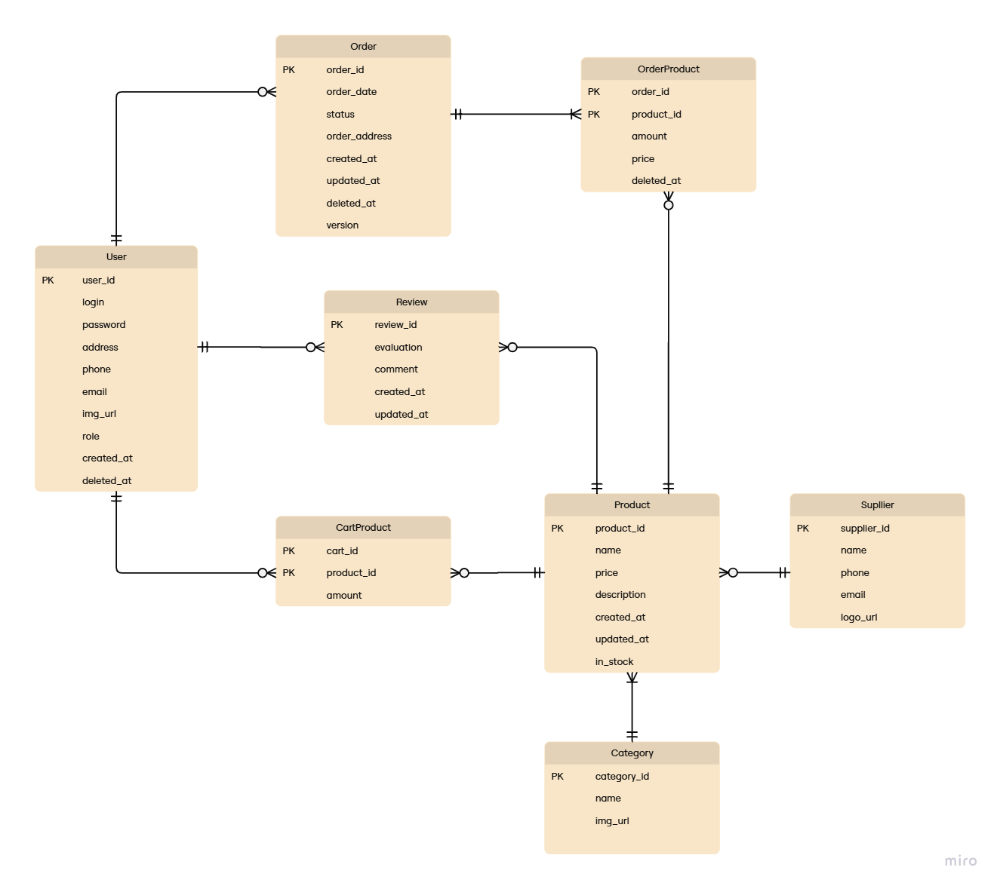

### ERM-діаграма

### Таблиця: `users`

Призначення: Зберігає інформацію про облікові записи користувачів

Стовпці:
| Стовпець | Тип | Обмеження | Опис |
|----------|-----|-----------|------|
| user_id | SERIAL | PRIMARY KEY | Ідентифікатор користувача |
| login | VARCHAR(20) | UNIQUE, NOT NULL | Login користувача |
| password | VARCHAR(60) | NOT NULL | Пароль (захешований) |
| email | VARCHAR(50) | NOT NULL, UNIQUE, CHECK("email" LIKE '%@%') | Email користувача |
| phone | VARCHAR(30) | NOT NULL, CHECK("phone" LIKE '+%') | Номер користувача |
| address | VARCHAR(30) | NOT NULL | Адреса користувача |
| img_url | TEXT | - | Посилання на логотип |
| role | USERS_ROLE_ENUM | NOT NULL, DEFAULT(USER)  | Права доступу користувача |
| created_at | TIMESTAMP | DEFAULT NOW() | Час створення облікового запису |
| deleted_at | TIMESTAMP | NULL | Мітка часу м'якого видалення |

Індекси:
- `IDX_USER_ID` на `login` (для пошуку при вході)

Зв'язки:
- Один-до-багатьох з `orders` (користувач може мати кілька замовлень)
- Один-до-багатьох з `cart` (користувач може мати багато продуктів у корзині)
- Один-до-багатьох з `review` (користувач може мати багато відгуків)

---

### Таблиця: `orders`

Призначення: Зберігає інформацію про усі замовлення

Стовпці:
| Стовпець | Тип | Обмеження | Опис |
|----------|-----|-----------|------|
| order_id | SERIAL | PRIMARY KEY | Ідентифікатор замовлення |
| status | ORDERS_STATUS_ENUM | NOT NULL, DEFAULT(WAITING) | Статус замовлення |
| order_address | VARCHAR(20) | NOT NULL | Адреса замовлення (куди прямує) |
| user_id | INTEGER | NOT NULL, FOREIGN KEY | Ідентифікатор користувача, який замовляє |
| version | INTEGER | NOT NULL, DEFAULT(1)  | Версія оновлення замовлення (для оптимістичного блокування) |
| created_at | TIMESTAMP | DEFAULT NOW() | Час створення замовлення |
| updated_at | TIMESTAMP | DEFAULT NOW() | Час оновлення замовлення |
| deleted_at | TIMESTAMP | NULL | Мітка часу м'якого видалення |

Зв'язки:
- Багато-до-одного з `users` (замовлення може мати тільки одного користувача)
- Один-до-багатьох з `order_product` (замовлення може мати багато продуктів)

---

### Таблиця: `product`

Призначення: Зберігає інформацію про товари

Стовпці:
| Стовпець | Тип | Обмеження | Опис |
|----------|-----|-----------|------|
| product_id | SERIAL | PRIMARY KEY | Ідентифікатор товару |
| name | VARCHAR(30) | NOT NULL | Назва товару |
| price | INTEGER | NOT NULL, CHECK("price" > 0) | Ціна товару |
| description | TEXT | NOT NULL | Опис товару |
| img_url | TEXT | - | Посилання на зображення товару |
| supplier_id | INTEGER | NOT NULL, FOREIGN KEY | Ідентифікатор власника товару |
| category_id | INTEGER | NOT NULL, FOREIGN KEY | Ідентифікатор категорії товару  |
| created_at | TIMESTAMP | DEFAULT NOW() | Час створення товару |
| updated_at | TIMESTAMP | DEFAULT NOW() | Час оновлення товару |

Зв'язки:
- Багато-до-одного з `supplier` (Багато замовлень можуть належить одному власнику)
- Багато-до-одного з `category` (Багато замовлень можуть належить одній категорії)
- Один-до-багатьох з `order_product` (товар може мати багато замовлень)
- Один-до-багатьох з `cart_product` (товар може лежати у декількох корзинах)
- Один-до-багатьох з `review` (товар може мати багато відгуків)

---

### Таблиця: `category`

Призначення: Зберігає інформацію про категорії

Стовпці:
| Стовпець | Тип | Обмеження | Опис |
|----------|-----|-----------|------|
| category_id | SERIAL | PRIMARY KEY | Ідентифікатор категорії |
| img_url | TEXT | NOT NULL | Посилання на зображення категорії |
| name | VARCHAR(20) | NOT NULL | Назва категорії |

Індекси:
- `"IDX_category_name"` на `name`

Зв'язки:
- Один-до-багатьох з `product` (категорія може мати багато товарів)

---

### Таблиця: `supplier`

Призначення: Зберігає інформацію про постачальників

Стовпці:
| Стовпець | Тип | Обмеження | Опис |
|----------|-----|-----------|------|
| supplier_id | SERIAL | PRIMARY KEY | Ідентифікатор постачальника |
| name | VARCHAR(50) | NOT NULL | Назва постачальника |
| phone | VARCHAR(30) | NOT NULL, CHECK("phone" LIKE '+%') | Номер постачальника |
| email | VARCHAR(50) | NOT NULL, CHECK("email" LIKE '%@%') | Email постачальника |
| logo_url | TEXT | - | Посилання на логотип постачальника |

Зв'язки:
- Один-до-багатьох з `product` (постачальник може мати багато товарів)

---

### Таблиця: `review`

Призначення: Зберігає інформацію про відгуки

Стовпці:
| Стовпець | Тип | Обмеження | Опис |
|----------|-----|-----------|------|
| review_id | SERIAL | PRIMARY KEY | Ідентифікатор відгука |
| user_id |INTEGER | NOT NULL, FOREIGN KEY | Ідентифікатор користувача, який написав |
| product_id |INTEGER | NOT NULL, FOREIGN KEY | Ідентифікатор товару, на який відгук написали |
| evaluation | SMALLINT | NOT NULL, CHECK("evaluation" >= 0 AND "evaluation" <= 5) | Оцінка товару |
| comment | TEXT | NOT NULL | Текст відгуку |
| created_at | TIMESTAMP | DEFAULT NOW() | Час створення відгуку |
| updated_at | TIMESTAMP | DEFAULT NOW() | Час оновлення відгуку |

Зв'язки:
- Багато-до-одного з `product` (Багато замовлень можуть належить одному власнику)
- Багато-до-одного з `users` (Багато замовлень можуть належить одному власнику)

---

### Таблиця: `order_product`

Призначення: Зберігає інформацію про товари з замовлень(асоціативна таблиця)

Стовпці:
| Стовпець | Тип | Обмеження | Опис |
|----------|-----|-----------|------|
| order_id | SERIAL | PRIMARY KEY | Ідентифікатор замовлення |
| product_id |INTEGER | PRIMARY KEY | Ідентифікатор товару |
| amount | INTEGER | NOT NULL, CHECK("amount" > 0) | Кількість товару в замовленні |
| price | INTEGER | NOT NULL, CHECK("price" > 0) | Ціна товар на момент замовлення |
| deleted_at | TIMESTAMP | NULL | Мітка часу м'якого видалення |

Зв'язки:
- Багато-до-одного з `orders` (Зв'язок з таблицей order)
- Багато-до-одного з `product` (Зв'язок з таблицей product)

---

### Таблиця: `cart_product`

Призначення: Зберігає інформацію про товари з кошику(асоціативна таблиця)

Стовпці:
| Стовпець | Тип | Обмеження | Опис |
|----------|-----|-----------|------|
| user_id | SERIAL | PRIMARY KEY | Ідентифікатор користувача |
| product_id |INTEGER | PRIMARY KEY | Ідентифікатор товару |
| amount | INTEGER | NOT NULL, CHECK("amount" > 0) | Кількість товару в кошику |

Зв'язки:
- Багато-до-одного з `users` (Зв'язок з таблицей users)
- Багато-до-одного з `product` (Зв'язок з таблицей product)
